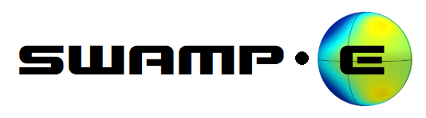

## Coming soon!

   

   
   </img>
    
   

     

# Shallow-Water Atmospheric Model in Python for Exoplanets

Written by [Ekaterina Landgren](https://github.com/kathlandgren) and [Alice Nadeau](https://github.com/Alice-N).

email: ek672@cornell.edu
